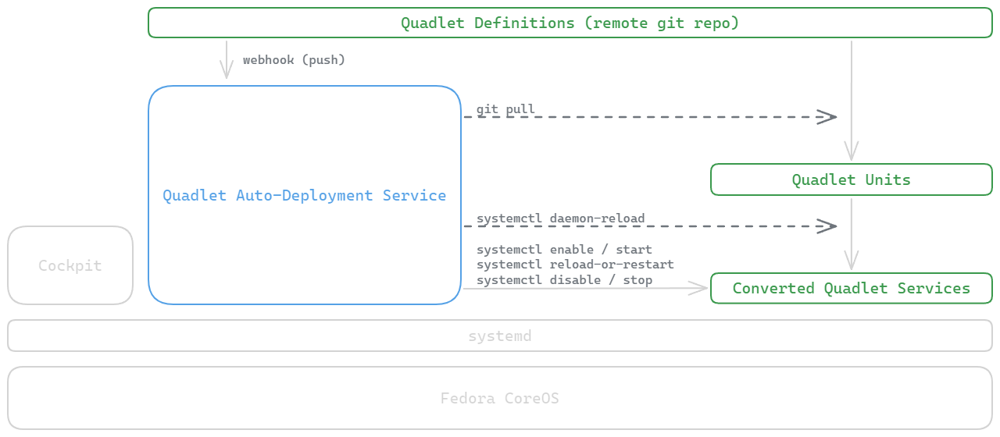

# Quadlet Auto-Deployment

We'll leverage Podman Quadlets to run our servces. Podman quadlets are defined in unit files which are converted by Podman into systemd service files during the `systemctl daemon-reload` command. I'd like for these quadlet definitions to be automatically deployed to the server once there are any changes to their definitions. The required process flow to accommodate this looks like this:

1. Create a remote repo of Quadlet Unit Files. See the [Quadlet Definition Repository](#quadlet-definition-repository)
2. Clone the repository to a local store within the server, in the directory intended for storing non-root Quadlet files: `/etc/containers/systemd/users/`.
3. Setup a webhook so that any changes pushed to the remote repository fires a repository update payload directed at a service running on the server.
4. Create a Quadlet Auto-Deployment service which will receive the webhook, and on receiving it:
    * Store a record of the current quadlet definitions
    * Pull the latest changes from the remote repository
    * Run `systemctl --user daemon-reload` so Podman can convert the Quadlet definitions into corresponding systemd service units.
    * Compare the new quadlet definitions with the previous definitions
    * For each file:
      * If the quadlet unit file is new, run:

        ```bash
        systemctl --user start quadlet-name{-quadlet-type}.service
        systemctl --user enable quadlet-name{-quadlet-type}.service
        ```

      * If the quadlet file has been updated, run:

        ```bash
        systemctl --user reload-or-restart quadlet-name{-quadlet-type}.service
        ```

      * If the quadlet file has been deleted, run:

        ```bash
        systemctl --user stop quadlet-name{-quadlet-type}.service
        systemctl --user disable quadlet-name{-quadlet-type}.service
        ```

## Systemd Service Interaction



## Quadlet Definition Repository

Quadlet Definition files are systemd unit files with particular config for Podman to use when converting their definitions into systemd services. The [Podman Quadlet Documentation](https://docs.podman.io/en/v5.0.1/markdown/podman-systemd.unit.5.html) is an awesome resource for the configurations available and the expected behavior of different Quadlet configs.

This configuration expects a remote repository which stores all the Podman Quadlet definitions that will be auto-deployed on change to the server.

The repository only requires a folder for storing insensitive container configuration environment files in a directory called `env` at the root of your repository. These configuration files will be copied into the `~/containers/config/` directory to be used by your container definitions.

```bash
env/              # Required directory for environment files storing insensitive container config
├── default.env   # Example: Store common config like timezone or container user
└── example.env   # Example: Specific config file to be pulled into containers.
```

Besides the `env/` directory, Quadlet files can be placed in any structure in the repository. For example:

```bash
env/
├── default.env
└── example.env
networks/
├── media.network
├── development.network
├── automation.network
└── infrastructure.network
containers/
├── media/
│   ├── sonarr.container
│   ├── prowlarr.container
│   ├── jellyfin.container
│   └── qbittorrent.container
├── development/
│   ├── woodpecker.container
│   ├── registry.container
│   ├── maven-repository.container
│   ├── mysql.container
│   └── custom-java-app.container
├── automation/
│   └── home-assistant.container
└── infrastructure/
    ├── nginx-proxy-manager.container
    ├── cloudflare-ddns.container
    ├── ntfy.container
    └── rabbitmq.container
```

The following are examples of Quadlet files.

## Container Quadlet

Container Quadlets define Podman image containers that will be converted into systemd running services. Containers are named as `$container-name.container`. When `systemctl --user daemon-reload` is run, Container Quadlets will be converted into systemd services named `$container-name.service`.

For detailed descriptions of the kinds of configuration available for Podman Quadlets, have a look at the [Podman Quadlet Documentation](https://docs.podman.io/en/v5.0.1/markdown/podman-systemd.unit.5.html) or else this [Podman Quadlet Template README](https://github.com/fpatrick/podman-quadlet/blob/main/readme.md) for detailed examples. An example container definition is as follows:

```ini
[Unit]
Description=NGINX Proxy Manager Container

# Quadlets that this Quadlet is dependent on
After=network-online.target infrastructure.network nginx-proxy-manager.volume nginx-proxy-manager-certs.volume
Wants=network-online.target infrastructure.network nginx-proxy-manager.volume nginx-proxy-manager-certs.volume

[Container]
ContainerName=nginx-proxy-manager
Image=docker.io/jc21/nginx-proxy-manager:2.9.22

# Allow Podman to automatically update this container when new versions of the image are available
AutoUpdate=registry

PublishPort=8080:80
PublishPort=8081:81
PublishPort=8443:443

# See Network Quadlet for details on configuring a SubNet for containers
Network=infrastructure.network 

# Load an environment file to be referenced in this definition. Multiple files can be loaded.
EnvironmentFile=%h/containers/config/default.env
EnvironmentFile=%h/containers/config/example.env # Overwrites any values also defined in default.env

# Use an environment variable in one of the loaded environment files
Timezone=${TZ}

# Mount named volumes. See Volume Quadlet for more details
Volume=nginx-proxy-manager.volume:/data:Z
Volume=nginx-proxy-manager-certs.volume:/etc/letsencrypt:Z

[Service]
Restart=always

[Install]
WantedBy=multi-user.target default.target
```

## Volume Quadlet

Volume Quadlets define Podman image containers that will be converted into a service definition, and run once to establish the volume for containers to use. Volumes are named as `$volume-name.volume`. When `systemctl --user daemon-reload` is run, Volume Quadlets will be converted into systemd services named `$volume-name-volume.service`. An example volume definition is as follows:

```ini
[Unit]
Description=NGINX Proxy Manager Data Volume

[Volume]
Driver=local
```

## Network Quadlet

Network Quadlets define Podman image containers that will be converted into a service definition, and run once to establish the network for containers to use. Networks are named as `$network-name.network`. When `systemctl --user daemon-reload` is run, Network Quadlets will be converted into systemd services named `$network-name-network.service`. An example network definition is as follows:

```ini
[Unit]
Description=Infrastructure Services Network

[Network]
Subnet=10.0.0.0/24
Gateway=10.0.0.1
```
